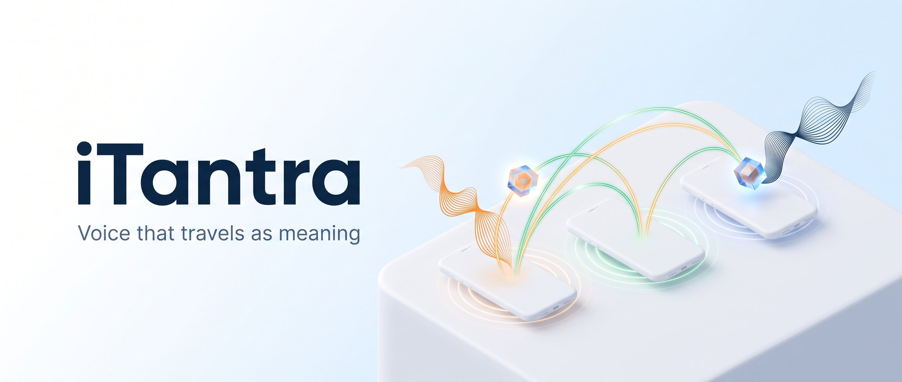
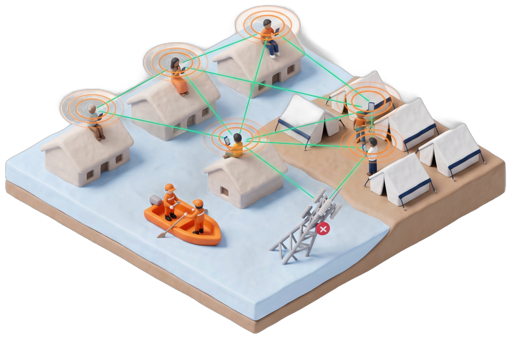
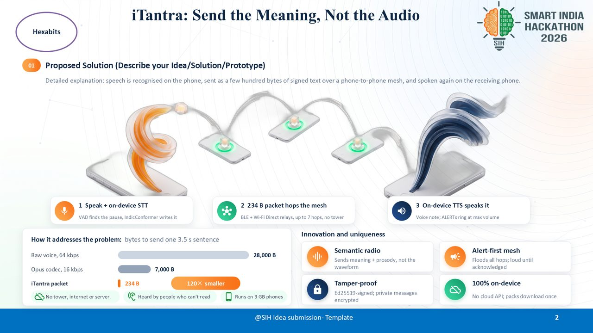
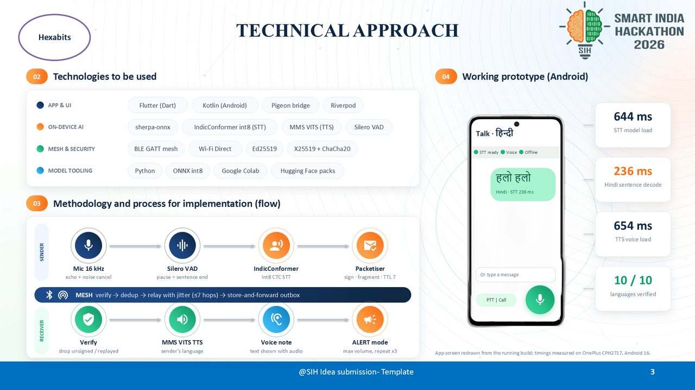
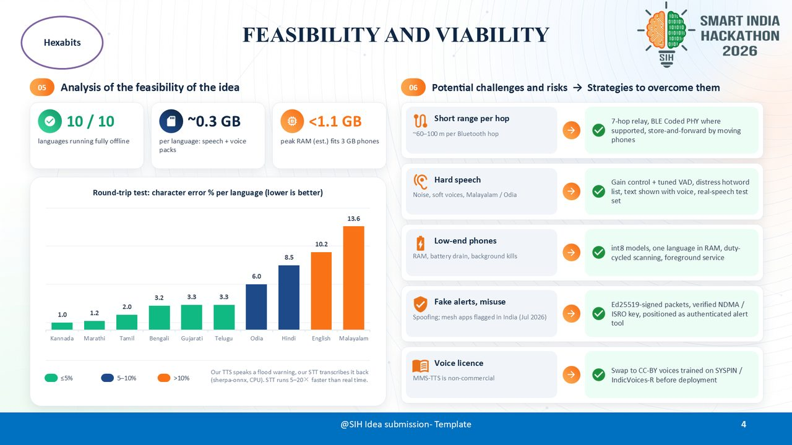
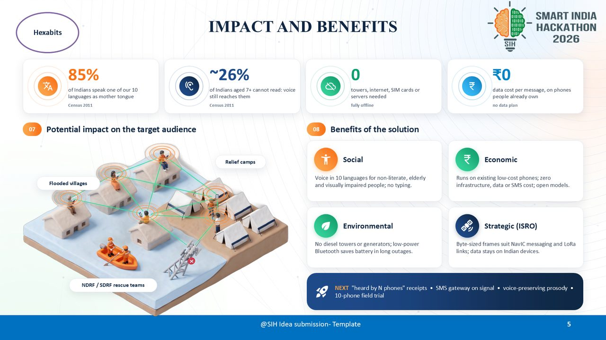

<div align="center">



# iTantra

### A walkie-talkie that works when every tower is down.

Speak in your language. iTantra turns your voice into a **234-byte** signed packet, hops it phone to phone over Bluetooth and Wi-Fi Direct, and **speaks it aloud** on the other side.
No internet. No SIM. No server. Ten Indian languages. Runs on a 3 GB phone.

[](#try-it-in-2-minutes)
[](app/)
[](app/android/app/src/main/kotlin/itantra)
[](https://github.com/k2-fsa/sherpa-onnx)
[](#how-it-works)
[](#languages)
[](https://huggingface.co/datasets/Mr66/itantra-packs)
[](LICENSE)
[](#smart-india-hackathon-2026)

**[Try it](#try-it-in-2-minutes)** · **[How it works](#how-it-works)** · **[Numbers](#real-numbers-from-a-real-phone)** · **[Model packs](https://huggingface.co/datasets/Mr66/itantra-packs)** · **[Roadmap](#roadmap)**

</div>

---

## The problem

Floods, cyclones and earthquakes take out cell towers first. That is exactly when people need to talk.

- **Voice beats text** in an emergency. Many people cannot read or type quickly, and nobody types well while wading through water.
- **Voice is heavy.** Even a good codec needs thousands of bytes per sentence. Bluetooth mesh links, weak radio and LoRa-class links choke on that.
- **Existing mesh apps** (FireChat, Bridgefy, BitChat) are text-first and English-first.

## The idea: send the meaning, not the audio

<div align="center">

</div>

The phone that hears you writes down what you said. Only those words travel. The phone that receives them says them out loud again, in the same language.

| One 3.5 second sentence | Bytes on the air |
|---|---:|
| Raw voice, 64 kbps | `28,000 B` |
| Opus codec, 16 kbps | `7,000 B` |
| **iTantra packet** (text + 64 B signature) | **`234 B`** |

> **120× smaller than raw voice, 30× smaller than Opus.** Small enough to fit in a single Bluetooth packet and hop 7 phones.

## What makes it different

| Feature | What it means |
|---|---|
| **Voice in, voice out** | Nobody has to read or type. Works for elderly, non-literate and visually impaired users. |
| **Truly offline** | Speech recognition, speech synthesis and the mesh all run on the phone. Airplane mode + Bluetooth is enough. |
| **10 Indian languages** | Hindi, Bengali, Marathi, Gujarati, Tamil, Telugu, Kannada, Malayalam, Odia and English. |
| **Multi-hop mesh** | Every phone relays for its neighbours. BLE GATT mesh always on, Wi-Fi Direct when available, up to 7 hops, store-and-forward outbox. |
| **Alert mode** | Emergency broadcasts flood every hop and play at **maximum volume**, repeating until someone taps acknowledge. |
| **Tamper-proof** | Every packet is Ed25519-signed, so fake alerts are dropped. Private messages use X25519 + ChaCha20-Poly1305. |
| **Cheap phones** | int8 models, one language loaded at a time. Designed for 3 GB RAM devices. |
| **Two talk modes** | Push-to-talk like a walkie-talkie, or a hands-free continuous "call" mode where each sentence is sent the moment you pause. |

## How it works

```mermaid
flowchart LR
    subgraph A["Phone A: sender"]
        direction TB
        M["Mic 16 kHz<br/>echo + noise cancel"] --> V["Silero VAD<br/>pause = end of sentence"]
        V --> S["IndicConformer int8<br/>on-device STT"]
        S --> P["Packetiser<br/>sign · fragment · TTL 7"]
    end
    subgraph MESH["Phone-to-phone mesh"]
        direction TB
        R1(("relay")) --- R2(("relay")) --- R3(("relay"))
    end
    subgraph B["Phone B: receiver"]
        direction TB
        VE["Verify signature<br/>drop fakes + replays"] --> T["MMS VITS<br/>on-device TTS"]
        T --> O["Voice note<br/>or max-volume alert"]
    end
    P -- "234 B over BLE / Wi-Fi Direct" --> R1
    R3 --> VE
```



| Layer | Built with |
|---|---|
| App and UI | Flutter (Dart), Riverpod, go_router, Pigeon typed bridge |
| Native core | Kotlin: audio capture, playback, alert focus, foreground service |
| Speech AI | [sherpa-onnx](https://github.com/k2-fsa/sherpa-onnx) running [AI4Bharat IndicConformer](https://github.com/AI4Bharat/IndicConformerASR) (STT), [Meta MMS-TTS](https://huggingface.co/facebook/mms-tts) VITS (TTS), [Silero VAD](https://github.com/snakers4/silero-vad) |
| Mesh | Clean-room Kotlin BLE GATT mesh + Wi-Fi Direct, inspired by the public [BitChat whitepaper](https://github.com/permissionlesstech/bitchat) |
| Security | Ed25519 identities and signatures, X25519 + ChaCha20-Poly1305 for private messages (BouncyCastle) |
| Tooling | Python + ONNX int8 export, Google Colab, packs hosted on Hugging Face |

The full wire format is in [`docs/protocol.md`](docs/protocol.md).

## Real numbers from a real phone

Measured on a OnePlus CPH2717 (Android 16), CPU only:

| What | Time |
|---|---:|
| Decode one Hindi sentence (STT) | **236 ms** |
| Load a speech-recognition model | 644 ms |
| Load a voice (TTS) | 654 ms |
| Languages passing the round-trip test | **10 / 10** |

Speech recognition runs about **5 to 20 times faster than real time**.

## Languages

Round-trip test: our TTS speaks a flood warning, our STT transcribes it back, and we measure the character error rate (lower is better).

| Language | Code | Character error |
|---|:---:|---:|
| Kannada | `kn` | 1.0 % |
| Marathi | `mr` | 1.2 % |
| Tamil | `ta` | 2.0 % |
| Bengali | `bn` | 3.2 % |
| Gujarati | `gu` | 3.3 % |
| Telugu | `te` | 3.3 % |
| Odia | `or` | 6.0 % |
| Hindi | `hi` | 8.5 % |
| English | `en` | 10.2 % |
| Malayalam | `ml` | 13.6 % |

> These numbers come from synthetic speech on a desktop CPU, not real voices in the field. A real-speech benchmark is on the roadmap.

## Try it in 2 minutes

1. **Install the APK** from the [latest release](https://github.com/nileshpatil6/SIH-Hexabits/releases/latest) (Android 8.0+, arm64).
2. Tap **Download speech models** and download your language (about 300 MB). Packs come straight from [Hugging Face](https://huggingface.co/datasets/Mr66/itantra-packs) and are only needed once; after that you can go fully offline.
3. Install on a second phone, turn on **airplane mode + Bluetooth** on both, hold the mic button and talk.

### Build from source

Requires Flutter 3.44+, JDK 17 and the Android SDK.

```bash
git clone https://github.com/nileshpatil6/SIH-Hexabits.git && cd SIH-Hexabits

# sherpa-onnx runtime (50 MB, not committed)
curl -L -o app/android/app/libs/sherpa-onnx-1.13.8.aar \
  https://github.com/k2-fsa/sherpa-onnx/releases/download/v1.13.8/sherpa-onnx-1.13.8.aar

cd app && flutter pub get && flutter run
```

<details>
<summary><b>Build your own model packs</b></summary>

Each `.itpack` is a zip with a `manifest.json` and model files. Typical flow for Hindi (the MMS export needs Linux or Colab):

```bash
pip install -r tools/requirements.txt
python tools/stt/fetch_indicconformer_onnx.py --out tools/work/stt --langs hi
python tools/tts/export_mms.py --out tools/work/tts/mms --langs hi
python tools/packs/build_pack.py stt --lang hi --dir tools/work/stt/hi --out dist/
python tools/packs/build_pack.py tts --lang hi --dir tools/work/tts/mms/hi --out dist/
```

Import them with the import button on the **Model packs** screen.

</details>

<details>
<summary><b>Run the tests</b></summary>

```bash
cd app && flutter test
cd app/android && ./gradlew :app:testDebugUnitTest
```

</details>

## Repository map

| Path | What lives there |
|---|---|
| [`app/`](app/) | Flutter UI |
| [`app/pigeons/itantra.dart`](app/pigeons/itantra.dart) | Typed Flutter ↔ Kotlin bridge |
| [`…/kotlin/itantra/mesh`](app/android/app/src/main/kotlin/itantra/mesh) | Packet codec, fragmentation, dedup, signing, router, BLE and Wi-Fi Direct transports |
| [`…/kotlin/itantra/speech`](app/android/app/src/main/kotlin/itantra/speech) | STT and TTS engines, model pack manager |
| [`…/kotlin/itantra/audio`](app/android/app/src/main/kotlin/itantra/audio) | Mic capture, VAD sentence splitting, playback, alert mode |
| [`tools/`](tools/) | Laptop and Colab Python: model export, quantization, pack building, benchmarks |
| [`docs/`](docs/) | Wire protocol and the SIH idea deck |
| [`HANDOFF.md`](HANDOFF.md) | Deep technical notes: decisions, status, known issues |

## Who it is for

<div align="center">

</div>

- **Disaster response**: NDRF / SDRF teams, relief camps and flooded villages talking with no network.
- **Remote areas**: hills, forests, borders and ships out of tower range.
- **Crowds**: melas, stadiums and protests where the network collapses under load.
- **Inclusion**: anyone who speaks better than they read, in their own language.

## Roadmap

- [x] On-device STT + TTS for 10 languages
- [x] BLE mesh + Wi-Fi Direct with signed packets
- [x] Push-to-talk, continuous mode and max-volume alerts
- [x] One-tap model downloads from Hugging Face
- [ ] "Heard by N phones" delivery receipts
- [ ] Voice-preserving prosody (tone and urgency travel with the text)
- [ ] Commercially licensed voices trained on SYSPIN / IndicVoices-R
- [ ] Real-speech benchmark and a 10-phone field trial
- [ ] Gateway: forward to SMS the moment any phone regains signal

## Smart India Hackathon 2026

Built by **Team Hexabits** for **SIH 2026, problem statement 26173 (ISRO)**:
*"iTantra: Indian Multilingual TTS & STT Aided Neural Transceiver Radio Access for low bitrate links"*.

<table>
<tr>
<td></td>
<td></td>
</tr>
<tr>
<td></td>
<td></td>
</tr>
</table>

Full idea deck: [PDF](docs/ppt/iTantra_SIH2026_Hexabits.pdf) · [PPTX](docs/ppt/iTantra_SIH2026_Hexabits.pptx)

## Contributing

Issues and pull requests are welcome, especially:

- **Real voice recordings** in any of the 10 languages for benchmarking
- Field tests on low-end phones (tell us the model, RAM and what broke)
- New languages: Punjabi, Assamese, Urdu and more are one model pack away

If iTantra could help someone you know, **star the repo** so more people find it.

## Licenses

- **App code** in this repo: [MIT](LICENSE).
- **Models** keep their own licenses: IndicConformer (MIT), NVIDIA English STT (CC-BY-4.0), Silero VAD (MIT), sherpa-onnx (Apache-2.0).
- **Meta MMS-TTS voices are CC-BY-NC-4.0 (non-commercial).** Swapping them for CC-BY voices is on the roadmap before any commercial use.

## Built on the shoulders of

[AI4Bharat](https://ai4bharat.iitm.ac.in/) · [k2-fsa / sherpa-onnx](https://github.com/k2-fsa/sherpa-onnx) · [Meta MMS](https://huggingface.co/facebook/mms-tts) · [Silero](https://github.com/snakers4/silero-vad) · [BitChat](https://github.com/permissionlesstech/bitchat) · [Hugging Face](https://huggingface.co/)

<div align="center">

**Made in India, for the moments when nothing else works.**

</div>
